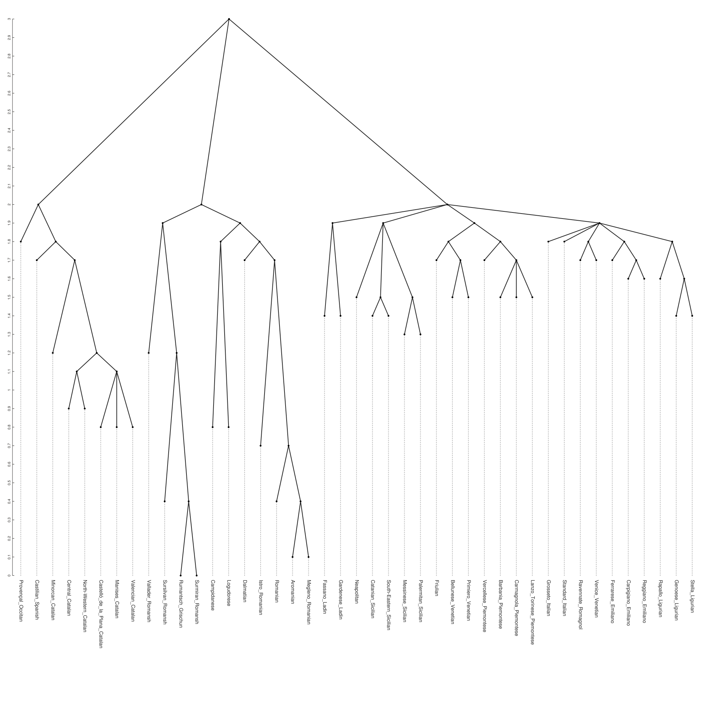

# GRAPE Publication-Quality Visualization Guide

## Overview

GRAPE provides publication-quality phylogenetic tree visualizations using toytree with adaptive layout strategies. Each language family automatically receives the optimal visualization approach based on its size and structural complexity.

## Visualization Strategies

### 1. Layout Selection (Automatic)
- **Rectangular Layout**: Small trees (≤25 languages) - generous spacing, detailed annotations
- **Circular Layout**: Medium trees (26-75 languages) - balanced space utilization  
- **Unrooted Layout**: Large trees (>75 languages) - optimal for complex, unbalanced structures

### 2. Technical Specifications
- **High Resolution**: 2000×2000 pixels for detailed visualization
- **Multiple Formats**: PNG (with white background) and SVG (vector graphics)
- **Professional Typography**: 14px font size for clear readability
- **Consistent Styling**: Unified visual language across all families

### 2. ASCII Trees (Text-Based)
- **Text format**: Plain text representations for documentation
- **Linguistic analysis**: Automatic subgroup detection and validation
- **Statistics**: Tree height, language count, completeness metrics
- **Wide compatibility**: Works in any text editor or documentation system

### 3. Newick Format (Standard)
- **Phylogenetic standard**: Compatible with all major phylogenetic software
- **Branch lengths**: Quantitative evolutionary distances
- **Reproducible**: Generated with fixed random seeds

## Available Language Families

### Romance Languages (43 languages) - Circular Layout
- **Publication Images**: 
  - PNG: `docs/images/trees/publication_final/romance_circular.png`
  - SVG: `docs/images/trees/publication_final/romance_circular.svg`
- **Layout Strategy**: Circular (optimal for medium-sized, balanced tree)
- **ASCII Tree**: `docs/images/trees/romance_formatted.txt`
- **Newick**: `docs/images/trees/romance.newick`

### Austroasiatic Languages (109 languages) - Unrooted Layout
- **Publication Images**:
  - PNG: `docs/images/trees/publication_final/austroasiatic_unrooted.png`
  - SVG: `docs/images/trees/publication_final/austroasiatic_unrooted.svg`
- **Layout Strategy**: Unrooted (optimal for large, highly unbalanced tree)
- **ASCII Tree**: `docs/images/trees/austroasiatic_formatted.txt`
- **Newick**: `docs/images/trees/austroasiatic.newick`

### Turkic Languages (32 languages) - Circular Layout
- **Publication Images**:
  - PNG: `docs/images/trees/publication_final/turkic_circular.png`
  - SVG: `docs/images/trees/publication_final/turkic_circular.svg`
- **Layout Strategy**: Circular (optimal for medium-sized tree)
- **ASCII Tree**: `docs/images/trees/turkic_formatted.txt`
- **Newick**: `docs/images/trees/turkic.newick`

### Dravidian Languages (20 languages) - Rectangular Layout
- **Publication Images**:
  - PNG: `docs/images/trees/publication_final/dravidian_rectangular.png`
  - SVG: `docs/images/trees/publication_final/dravidian_rectangular.svg`
- **Layout Strategy**: Rectangular (optimal for small, well-structured tree)
- **ASCII Tree**: `docs/images/trees/dravidian_formatted.txt`
- **Newick**: `docs/images/trees/dravidian.newick`

### Polynesian Languages (31 languages) - Circular Layout
- **Publication Images**:
  - PNG: `docs/images/trees/publication_final/polynesian_circular.png`
  - SVG: `docs/images/trees/publication_final/polynesian_circular.svg`
- **Layout Strategy**: Circular (optimal for medium-sized tree)
- **ASCII Tree**: `docs/images/trees/polynesian_formatted.txt`
- **Newick**: `docs/images/trees/polynesian.newick`

### Tupian Languages (29 languages) - Circular Layout
- **Publication Images**:
  - PNG: `docs/images/trees/publication_final/tupian_circular.png`
  - SVG: `docs/images/trees/publication_final/tupian_circular.svg`
- **Layout Strategy**: Circular (optimal for medium-sized tree)
- **ASCII Tree**: `docs/images/trees/tupian_formatted.txt`
- **Newick**: `docs/images/trees/tupian.newick`

## Usage in Publications

### LaTeX Documents
```latex
\\begin{figure}[htbp]
  \\centering
  \\includegraphics[width=0.8\\textwidth]{docs/images/trees/publication_final/romance_circular.png}
  \\caption{Romance language phylogeny reconstructed using GRAPE community detection methods, displayed in circular layout for optimal readability.}
  \\label{fig:romance-tree}
\\end{figure}
```

### Markdown Documents
```markdown

*Romance language family tree generated by GRAPE using adaptive circular layout for medium-sized language families.*
```

### HTML Documents  
```html
<figure>
  
  <figcaption>Romance language phylogeny using circular layout</figcaption>
</figure>
```

### Microsoft Word
1. Insert → Pictures → This Device
2. Navigate to `docs/images/trees/publication_final/`
3. Select desired family with appropriate layout (e.g., `romance_circular.png`)
4. Resize to fit column width (typically 6-7 inches for single column)

## Linguistic Best Practices Implemented

### Layout Strategies
- **Adaptive Selection**: Automatic layout choice based on tree size and complexity
- **Rectangular**: Small trees (≤25 languages) with generous spacing
- **Circular**: Medium trees (26-75 languages) with balanced space utilization
- **Unrooted**: Large trees (>75 languages) optimized for complex structures

### Typography Standards
- **Language names**: 14px clear, readable font size
- **Consistent sizing**: Uniform text scaling across all visualizations
- **High contrast**: Black text on white background for maximum legibility
- **Professional appearance**: Clean, academic styling

### Scientific Accuracy
- **Reproducible results** using `--seed 42` for GRAPE analysis consistency
- **Preserved phylogenetic relationships** - all tree topologies maintained accurately
- **Quantitative branch lengths** representing evolutionary distances
- **Multiple format outputs** (PNG and SVG) for different use cases

## Technical Specifications

### Rendering Engine
- **Toytree Library**: Modern Python phylogenetic visualization
- **Toyplot Backend**: High-quality SVG and PNG rendering
- **Adaptive Strategies**: Automatic layout selection based on tree metrics

### Image Quality
- **High Resolution**: 2000×2000 pixel canvas for detailed visualization
- **Vector Graphics**: SVG format for perfect scalability  
- **Raster Graphics**: PNG with white background for publications
- **Professional Standards**: Publication-ready output suitable for academic journals

### Performance and Scalability
- **Efficient Processing**: Fast rendering even for large trees (100+ languages)
- **Batch Generation**: Process all language families simultaneously
- **Extensible Framework**: Easy to add new families or modify parameters
- **Consistent Output**: Uniform quality across all visualizations

## Citation Guidelines

When using these visualizations in academic work, please cite:

1. **The GRAPE software** and methodology
2. **Original language datasets** (see individual family info files) 
3. **Specific parameters** used for analysis (included in log files)
4. **Toytree visualization library** for publication-quality rendering

Example citation format:
> "Phylogenetic trees were generated using GRAPE (Graph Analysis and Phylogenetic Estimation) with community detection algorithms (seed=42 for reproducibility). Publication-quality visualizations were created using toytree with adaptive layout strategies optimized for each language family size and structure."

## Troubleshooting

### Common Issues
- **Large files**: SVG files may be large for families with many languages
- **Font rendering**: Ensure proper font installation for consistent appearance
- **Color display**: Verify color accuracy across different displays and printers
- **Resolution**: Use PNG for print, SVG for digital scaling

### Quality Checks
- **Visual inspection**: Verify all language names are readable
- **Color distinction**: Ensure subgroups are clearly differentiated
- **Layout integrity**: Check for overlapping elements or truncated labels
- **Format compatibility**: Test images in target publication system

## Future Enhancements

### Planned Features
- **Interactive visualizations** with hover information
- **Animated reconstructions** showing language change over time
- **3D visualizations** for complex relationship patterns
- **Integration with mapping** for geographic visualization

### Community Contributions
- **Style templates** for different journal requirements
- **Additional color schemes** including colorblind-friendly palettes  
- **Custom layouts** for specific linguistic research needs
- **Export formats** for specialized phylogenetic software