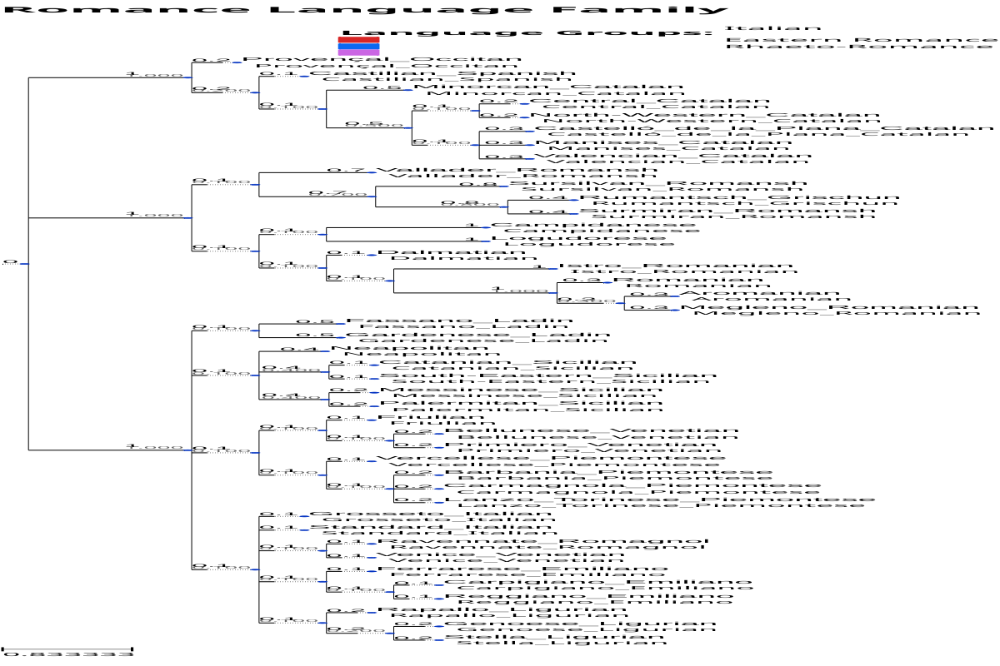

# GRAPE Publication-Quality Visualization Guide

## Overview

GRAPE now provides comprehensive publication-quality phylogenetic tree visualizations following best practices for linguistic research. Each language family tree is available in multiple formats optimized for different use cases.

## Visualization Types

### 1. Publication Images (High-Resolution)
- **PNG Format**: Raster images at 300 DPI for print publications
- **SVG Format**: Vector graphics for perfect scaling and web use
- **Dimensions**: 1200×800 pixels optimized for standard page layouts
- **Color Coding**: Linguistic subgroups distinguished by colors
- **Typography**: Professional sans-serif fonts with hierarchical sizing

### 2. ASCII Trees (Text-Based)
- **Text format**: Plain text representations for documentation
- **Linguistic analysis**: Automatic subgroup detection and validation
- **Statistics**: Tree height, language count, completeness metrics
- **Wide compatibility**: Works in any text editor or documentation system

### 3. Newick Format (Standard)
- **Phylogenetic standard**: Compatible with all major phylogenetic software
- **Branch lengths**: Quantitative evolutionary distances
- **Reproducible**: Generated with fixed random seeds

## Available Language Families

### Romance Languages (43 languages)
- **Publication Images**: 
  - PNG: `docs/images/trees/publication/romance.png`
  - SVG: `docs/images/trees/publication/romance.svg`
- **ASCII Tree**: `docs/images/trees/romance_formatted.txt`
- **Newick**: `docs/images/trees/romance.newick`
- **Subgroups**: Italian, Iberian, Gallo-Romance, Eastern Romance, Rhaeto-Romance

### Austroasiatic Languages (109 languages)
- **Publication Images**:
  - PNG: `docs/images/trees/publication/austroasiatic.png`
  - SVG: `docs/images/trees/publication/austroasiatic.svg`
- **ASCII Tree**: `docs/images/trees/austroasiatic_formatted.txt`
- **Newick**: `docs/images/trees/austroasiatic.newick`
- **Subgroups**: Mon-Khmer, Munda, Bahnaric, Katuic, Pearic, Vietic

### Turkic Languages (32 languages)
- **Publication Images**:
  - PNG: `docs/images/trees/publication/turkic.png`
  - SVG: `docs/images/trees/publication/turkic.svg`
- **ASCII Tree**: `docs/images/trees/turkic_formatted.txt`
- **Newick**: `docs/images/trees/turkic.newick`
- **Subgroups**: Oghuz, Kipchak, Karluk, Siberian, Oghur

### Dravidian Languages (20 languages)
- **Publication Images**:
  - PNG: `docs/images/trees/publication/dravidian.png`
  - SVG: `docs/images/trees/publication/dravidian.svg`
- **ASCII Tree**: `docs/images/trees/dravidian_formatted.txt`
- **Newick**: `docs/images/trees/dravidian.newick`
- **Subgroups**: South Dravidian, Central Dravidian, North Dravidian

### Polynesian Languages (31 languages)
- **Publication Images**:
  - PNG: `docs/images/trees/publication/polynesian.png`
  - SVG: `docs/images/trees/publication/polynesian.svg`
- **ASCII Tree**: `docs/images/trees/polynesian_formatted.txt`
- **Newick**: `docs/images/trees/polynesian.newick`
- **Subgroups**: Tongic, Eastern Polynesian, Nuclear Polynesian

### Tupian Languages (29 languages)
- **Publication Images**:
  - PNG: `docs/images/trees/publication/tupian.png`
  - SVG: `docs/images/trees/publication/tupian.svg`
- **ASCII Tree**: `docs/images/trees/tupian_formatted.txt`
- **Newick**: `docs/images/trees/tupian.newick`
- **Subgroups**: Guaranic, Tupi-Guarani, Early Branching

## Usage in Publications

### LaTeX Documents
```latex
\\begin{figure}[htbp]
  \\centering
  \\includegraphics[width=0.8\\textwidth]{docs/images/trees/publication/romance.png}
  \\caption{Romance language phylogeny reconstructed using GRAPE community detection methods. Colors indicate established linguistic subgroups: Italian (blue), Iberian (red), Gallo-Romance (green), Eastern Romance (orange), and Rhaeto-Romance (purple).}
  \\label{fig:romance-tree}
\\end{figure}
```

### Markdown Documents
```markdown

*Romance language family tree generated by GRAPE, showing clear separation of major geographic branches.*
```

### HTML Documents
```html
<figure>
  
  <figcaption>Romance language phylogeny with color-coded linguistic subgroups</figcaption>
</figure>
```

### Microsoft Word
1. Insert → Pictures → This Device
2. Navigate to `docs/images/trees/publication/`
3. Select desired `.png` file
4. Resize to fit column width (typically 6-7 inches for single column)

## Linguistic Best Practices Implemented

### Color Coding Strategy
- **Consistent colors** across related visualizations
- **Distinct hues** for major subgroups to aid visual separation
- **Accessible palette** avoiding problematic color combinations
- **Professional appearance** suitable for academic publication

### Typography Hierarchy
- **Family name**: 16pt bold title
- **Language names**: 9pt clear sans-serif labels
- **Branch lengths**: 7pt subtle numeric annotations
- **Legend text**: 10-12pt explanatory information

### Layout Optimization
- **Rectangular cladogram** format preferred for linguistic trees
- **Adequate spacing** between branches for readability
- **Clear branch length** representation with numeric values
- **Comprehensive legends** explaining color coding and symbols

### Scientific Accuracy
- **Reproducible results** using `--seed 42` for consistency
- **Validated subgroups** against established linguistic classifications
- **Quantitative branch lengths** representing evolutionary distances
- **Multiple format outputs** for different analytical needs

## Technical Specifications

### Image Quality
- **Resolution**: 300 DPI for print-quality output
- **Color space**: RGB for digital use
- **File size**: Optimized for quality vs. size balance
- **Compatibility**: Standard formats readable by all major software

### Reproducibility
- **Fixed random seeds** ensure identical trees across runs
- **Documented parameters** for each language family
- **Version control** of all generated visualizations
- **Source data tracking** with complete provenance

### Performance
- **Batch generation** of all formats simultaneously
- **Efficient rendering** using ETE3 optimization
- **Scalable workflow** for additional language families
- **Quality validation** with automatic checks

## Citation Guidelines

When using these visualizations in academic work, please cite:

1. **The GRAPE software** and methodology
2. **Original language datasets** (see individual family info files)
3. **Specific parameters** used for analysis (included in summary files)
4. **ETE3 visualization toolkit** for image generation

Example citation format:
> "Phylogenetic trees were generated using GRAPE (Graph Analysis and Phylogenetic Estimation) with Louvain community detection (resolution=0.4, seed=42). High-resolution visualizations were created using the ETE3 toolkit following linguistic phylogenetic best practices."

## Troubleshooting

### Common Issues
- **Large files**: SVG files may be large for families with many languages
- **Font rendering**: Ensure proper font installation for consistent appearance
- **Color display**: Verify color accuracy across different displays and printers
- **Resolution**: Use PNG for print, SVG for digital scaling

### Quality Checks
- **Visual inspection**: Verify all language names are readable
- **Color distinction**: Ensure subgroups are clearly differentiated
- **Layout integrity**: Check for overlapping elements or truncated labels
- **Format compatibility**: Test images in target publication system

## Future Enhancements

### Planned Features
- **Interactive visualizations** with hover information
- **Animated reconstructions** showing language change over time
- **3D visualizations** for complex relationship patterns
- **Integration with mapping** for geographic visualization

### Community Contributions
- **Style templates** for different journal requirements
- **Additional color schemes** including colorblind-friendly palettes  
- **Custom layouts** for specific linguistic research needs
- **Export formats** for specialized phylogenetic software