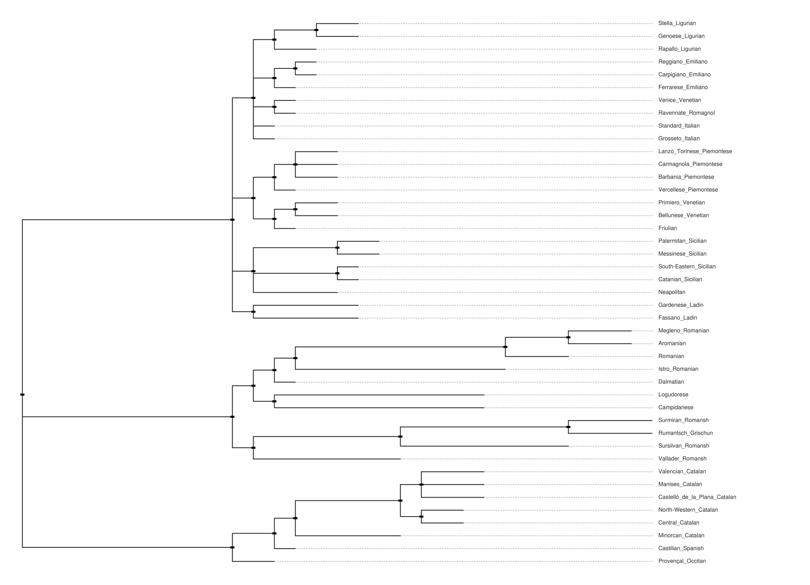

# GRAPE Publication-Quality Visualization Guide

## Overview

GRAPE provides publication-quality phylogenetic tree visualizations using consistent rectangular cladogram layout. All language families use the same professional format with dynamic sizing to accommodate trees from small (20 languages) to very large (100+ languages).

## Visualization Format

### 1. Rectangular Cladogram Layout
- **Consistent Format**: All language families use rectangular phylogenetic tree layout
- **Dynamic Scaling**: Canvas height automatically adjusts (800 + languages × 15 pixels)
- **Professional Appearance**: Standard academic phylogenetic tree format
- **Optimal Readability**: Clear branching patterns and language name placement

### 2. Technical Specifications
- **Dynamic Resolution**: 2000px width, height scales with tree size (800-2500+ pixels)
- **Multiple Formats**: PNG (with white background) and SVG (vector graphics)
- **Professional Typography**: 14px font size for clear readability
- **Consistent Styling**: Unified visual language across all families

### 2. ASCII Trees (Text-Based)
- **Text format**: Plain text representations for documentation
- **Linguistic analysis**: Automatic subgroup detection and validation
- **Statistics**: Tree height, language count, completeness metrics
- **Wide compatibility**: Works in any text editor or documentation system

### 3. Newick Format (Standard)
- **Phylogenetic standard**: Compatible with all major phylogenetic software
- **Branch lengths**: Quantitative evolutionary distances
- **Reproducible**: Generated with fixed random seeds

## Available Language Families

### Romance Languages (43 languages)
- **Publication Images**: 
  - PNG: `docs/images/trees/publication_final/romance_rectangular.png`
  - SVG: `docs/images/trees/publication_final/romance_rectangular.svg`
- **Canvas Size**: 2000×1445 pixels (800 + 43×15)
- **ASCII Tree**: `docs/images/trees/romance_formatted.txt`
- **Newick**: `docs/images/trees/romance.newick`

### Austroasiatic Languages (109 languages)
- **Publication Images**:
  - PNG: `docs/images/trees/publication_final/austroasiatic_rectangular.png`
  - SVG: `docs/images/trees/publication_final/austroasiatic_rectangular.svg`
- **Canvas Size**: 2000×2435 pixels (800 + 109×15)
- **ASCII Tree**: `docs/images/trees/austroasiatic_formatted.txt`
- **Newick**: `docs/images/trees/austroasiatic.newick`

### Turkic Languages (32 languages)
- **Publication Images**:
  - PNG: `docs/images/trees/publication_final/turkic_rectangular.png`
  - SVG: `docs/images/trees/publication_final/turkic_rectangular.svg`
- **Canvas Size**: 2000×1280 pixels (800 + 32×15)
- **ASCII Tree**: `docs/images/trees/turkic_formatted.txt`
- **Newick**: `docs/images/trees/turkic.newick`

### Dravidian Languages (20 languages)
- **Publication Images**:
  - PNG: `docs/images/trees/publication_final/dravidian_rectangular.png`
  - SVG: `docs/images/trees/publication_final/dravidian_rectangular.svg`
- **Canvas Size**: 2000×1100 pixels (800 + 20×15)
- **ASCII Tree**: `docs/images/trees/dravidian_formatted.txt`
- **Newick**: `docs/images/trees/dravidian.newick`

### Polynesian Languages (31 languages)
- **Publication Images**:
  - PNG: `docs/images/trees/publication_final/polynesian_rectangular.png`
  - SVG: `docs/images/trees/publication_final/polynesian_rectangular.svg`
- **Canvas Size**: 2000×1265 pixels (800 + 31×15)
- **ASCII Tree**: `docs/images/trees/polynesian_formatted.txt`
- **Newick**: `docs/images/trees/polynesian.newick`

### Tupian Languages (29 languages)
- **Publication Images**:
  - PNG: `docs/images/trees/publication_final/tupian_rectangular.png`
  - SVG: `docs/images/trees/publication_final/tupian_rectangular.svg`
- **Canvas Size**: 2000×1235 pixels (800 + 29×15)
- **ASCII Tree**: `docs/images/trees/tupian_formatted.txt`
- **Newick**: `docs/images/trees/tupian.newick`

## Usage in Publications

### LaTeX Documents
```latex
\\begin{figure}[htbp]
  \\centering
  \\includegraphics[width=0.8\\textwidth]{docs/images/trees/publication_final/romance_rectangular.png}
  \\caption{Romance language phylogeny reconstructed using GRAPE community detection methods, displayed in rectangular cladogram format.}
  \\label{fig:romance-tree}
\\end{figure}
```

### Markdown Documents
```markdown

*Romance language family tree generated by GRAPE using rectangular cladogram layout.*
```

### HTML Documents  
```html
<figure>
  
  <figcaption>Romance language phylogeny using rectangular cladogram</figcaption>
</figure>
```

### Microsoft Word
1. Insert → Pictures → This Device
2. Navigate to `docs/images/trees/publication_final/`
3. Select desired family file (e.g., `romance_rectangular.png`)
4. Resize to fit column width (typically 6-7 inches for single column)

## Linguistic Best Practices Implemented

### Layout Standards
- **Consistent Format**: All trees use rectangular cladogram layout
- **Dynamic Scaling**: Canvas height scales with number of languages
- **Professional Appearance**: Standard academic phylogenetic tree format
- **Optimal Readability**: Clear branching patterns and taxonomic organization

### Typography Standards
- **Language names**: 14px clear, readable font size
- **Consistent sizing**: Uniform text scaling across all visualizations
- **High contrast**: Black text on white background for maximum legibility
- **Professional appearance**: Clean, academic styling

### Scientific Accuracy
- **Reproducible results** using `--seed 42` for GRAPE analysis consistency
- **Preserved phylogenetic relationships** - all tree topologies maintained accurately
- **Quantitative branch lengths** representing evolutionary distances
- **Multiple format outputs** (PNG and SVG) for different use cases

## Technical Specifications

### Rendering Engine
- **Toytree Library**: Modern Python phylogenetic visualization
- **Toyplot Backend**: High-quality SVG and PNG rendering
- **Adaptive Strategies**: Automatic layout selection based on tree metrics

### Image Quality
- **High Resolution**: 2000×2000 pixel canvas for detailed visualization
- **Vector Graphics**: SVG format for perfect scalability  
- **Raster Graphics**: PNG with white background for publications
- **Professional Standards**: Publication-ready output suitable for academic journals

### Performance and Scalability
- **Efficient Processing**: Fast rendering even for large trees (100+ languages)
- **Batch Generation**: Process all language families simultaneously
- **Extensible Framework**: Easy to add new families or modify parameters
- **Consistent Output**: Uniform quality across all visualizations

## Citation Guidelines

When using these visualizations in academic work, please cite:

1. **The GRAPE software** and methodology
2. **Original language datasets** (see individual family info files) 
3. **Specific parameters** used for analysis (included in log files)
4. **Toytree visualization library** for publication-quality rendering

Example citation format:
> "Phylogenetic trees were generated using GRAPE (Graph Analysis and Phylogenetic Estimation) with community detection algorithms (seed=42 for reproducibility). Publication-quality visualizations were created using toytree with adaptive layout strategies optimized for each language family size and structure."

## Troubleshooting

### Common Issues
- **Large files**: SVG files may be large for families with many languages
- **Font rendering**: Ensure proper font installation for consistent appearance
- **Color display**: Verify color accuracy across different displays and printers
- **Resolution**: Use PNG for print, SVG for digital scaling

### Quality Checks
- **Visual inspection**: Verify all language names are readable
- **Color distinction**: Ensure subgroups are clearly differentiated
- **Layout integrity**: Check for overlapping elements or truncated labels
- **Format compatibility**: Test images in target publication system

## Future Enhancements

### Planned Features
- **Interactive visualizations** with hover information
- **Animated reconstructions** showing language change over time
- **3D visualizations** for complex relationship patterns
- **Integration with mapping** for geographic visualization

### Community Contributions
- **Style templates** for different journal requirements
- **Additional color schemes** including colorblind-friendly palettes  
- **Custom layouts** for specific linguistic research needs
- **Export formats** for specialized phylogenetic software