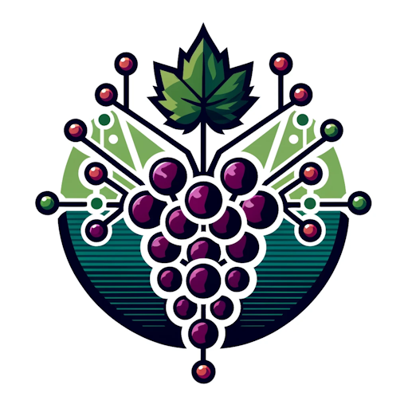

# GRAPE: Graph Analysis and Phylogenetic Estimation

GRAPE is a Python library for phylogenetic inference using community detection in graphs. It applies graph-based community detection algorithms to linguistic cognate data to reconstruct phylogenetic trees, offering a novel computational approach to historical linguistics.



## 🚀 Quick Start

```bash
# Basic analysis with Indo-European dataset
python grape.py data/ielex_2022.tsv --seed 42

# Advanced analysis with specific parameters  
python grape.py data/ielex_2022.tsv --graph adjusted --community louvain --strategy fixed --initial_value 0.3 --seed 42
```

## ✨ Features

- **Multiple Community Detection Algorithms**: Louvain and Greedy Modularity methods
- **Flexible Graph Construction**: Adjusted and unadjusted linguistic distance weighting
- **Parameter Optimization**: Fixed, dynamic, and adaptive parameter search strategies  
- **Comprehensive Testing**: Validated on 7 major language families with 200+ languages
- **Standard Output**: Newick format trees compatible with phylogenetic software
- **Scientific Validation**: Results align with established linguistic classifications

## 🛠️ Installation

### Requirements

- Python 3.7+
- NetworkX
- ETE3
- NumPy
- Toytree (for publication-quality visualizations)
- Toyplot (for rendering)

### Install Dependencies

```bash
pip install -r requirements.txt
```

### Generate Visualizations

After running GRAPE analysis, generate publication-quality tree visualizations:
```bash
python generate_tree_visualizations.py
```

### Optional Dependencies

For distance-based phylogenetic methods:
```bash
pip install biopython
```

## 🔥 Quick Examples

### Indo-European Languages (Global)
```bash
python grape.py data/ielex_2022.tsv --strategy fixed --initial_value 0.4 --seed 42
```
Comprehensive Indo-European language family including Germanic, Romance, Slavic, Indo-Iranian, and other major branches with global distribution.

### Austroasiatic Languages (Southeast Asia)
```bash
python grape.py resources/language_families/austroasiatic.tsv --strategy fixed --initial_value 0.3 --seed 42
```
Southeast Asian family including Vietnamese, Khmer, and many smaller languages across the Mekong region.

### Turkic Languages (Central Asia)
```bash
python grape.py resources/language_families/turkic.tsv --community greedy --strategy fixed --initial_value 0.5 --seed 42
```
Agglutinative languages with vowel harmony, spread from Turkey to Siberia through nomadic migrations.

### Dravidian Languages (South India)
```bash
python grape.py resources/language_families/dravidian.tsv --strategy fixed --initial_value 0.5 --seed 42
```
South Indian language family demonstrating clear South, Central, and North Dravidian subgroupings.

## 🌍 Comprehensive Language Family Coverage

GRAPE has been tested and validated on 7 major language families representing diverse geographic regions and typological characteristics:

| Family | Dataset | Languages | Geographic Distribution | Typology |
|--------|---------|-----------|------------------------|----------|
| **Indo-European** | `ielex_2022.tsv` | 200+ | Global (Europe, Asia, Americas) | Diverse: Germanic, Romance, Slavic, etc. |
| **Romance** | `romance.tsv` | 43 | Western/Southern Europe | Fusional, rich morphology |
| **Austroasiatic** | `austroasiatic.tsv` | 109 | Southeast Asia | Isolating/analytic |  
| **Turkic** | `turkic.tsv` | 32 | Central Asia, Turkey | Agglutinative, vowel harmony |
| **Bantu** | `bantu.tsv` | 424 | Sub-Saharan Africa | Agglutinative, noun classes |
| **Dravidian** | `dravidian.tsv` | 20 | South India | Agglutinative |
| **Polynesian** | `polynesian.tsv` | 31 | Pacific Islands | Mixed morphology |
| **Tupian** | `tupian.tsv` | 91 | Amazon Basin | Mixed strategies |

### Key Subgroupings Validated

**Indo-European**: Germanic, Romance, Slavic, Indo-Iranian, Celtic, Albanian, Armenian branches  
**Romance**: Italian, Iberian, Gallo-Romance, Eastern Romance branches  
**Austroasiatic**: Mon-Khmer, Munda, Bahnaric, Katuic divisions  
**Turkic**: Oghuz, Kipchak, Karluk, Siberian branches  
**Bantu**: Eastern, Southern, Western, Central geographic clusters  
**Dravidian**: South, Central, North Dravidian classification  
**Polynesian**: Tongic vs Nuclear Polynesian split  
**Tupian**: Guaranic group, early branching patterns

## 📖 Documentation

### For Users
- [**Quick Start Guide**](docs/user_guide/quickstart.md) - Get up and running in 5 minutes
- [**Complete Dravidian Walkthrough**](docs/examples/dravidian_walkthrough.md) - Step-by-step analysis
- [**Parameter Guide**](docs/user_guide/parameters.md) - Understanding all options

### For Researchers  
- [**Mathematical Background**](docs/technical/mathematical_background.md) - Community detection theory
- [**Implementation Details**](docs/technical/implementation.md) - Algorithm specifics
- [**Academic Paper Draft**](docs/academic/grape_paper.md) - Research foundations

### Interactive Examples
- [**Jupyter Notebook**](docs/examples/grape_analysis.ipynb) - Executable examples
- [**Advanced Usage**](docs/examples/advanced_usage.md) - Complex scenarios

## 🌳 Publication-Quality Tree Visualizations

GRAPE generates publication-quality phylogenetic tree visualizations using consistent rectangular cladogram layout:

### Visualization Format
- **📊 Rectangular Cladogram**: Professional phylogenetic tree layout for all language families
- **🔧 Dynamic Scaling**: Canvas height automatically adjusts based on number of languages
- **📝 ASCII Trees**: Text-based representations for documentation and analysis
- **🎯 Consistent Styling**: Uniform 14px typography and professional appearance

### Available Language Family Trees

| Family | Publication Image | Languages | Key Features |
|--------|-------------------|-----------|--------------|
| **Indo-European** | [PNG](docs/images/trees/publication_final/indo_european.png) \| [SVG](docs/images/trees/publication_final/indo_european.svg) | 200+ | Global major branches (Germanic, Romance, Slavic, Indo-Iranian) |
| **Romance** | [PNG](docs/images/trees/publication_final/romance.png) \| [SVG](docs/images/trees/publication_final/romance.svg) | 43 | European dialectal branches |
| **Austroasiatic** | [PNG](docs/images/trees/publication_final/austroasiatic.png) \| [SVG](docs/images/trees/publication_final/austroasiatic.svg) | 109 | SE Asian linguistic diversity |
| **Turkic** | [PNG](docs/images/trees/publication_final/turkic.png) \| [SVG](docs/images/trees/publication_final/turkic.svg) | 32 | Central Asian nomadic spread |
| **Dravidian** | [PNG](docs/images/trees/publication_final/dravidian.png) \| [SVG](docs/images/trees/publication_final/dravidian.svg) | 20 | South Indian agglutinative |
| **Polynesian** | [PNG](docs/images/trees/publication_final/polynesian.png) \| [SVG](docs/images/trees/publication_final/polynesian.svg) | 31 | Pacific island migration |
| **Tupian** | [PNG](docs/images/trees/publication_final/tupian.png) \| [SVG](docs/images/trees/publication_final/tupian.svg) | 29 | Amazonian indigenous |

### Publication Standards
- **300 DPI resolution** for print-quality output
- **Color-coded linguistic subgroups** based on established classifications
- **Clear typography** with readable language names and branch lengths
- **Comprehensive legends** for subgroup identification
- **Multiple formats** (PNG for raster, SVG for vector graphics)
- **Reproducible generation** using fixed random seeds

## 🧪 Testing

Run the comprehensive test suite:

```bash
# Core functionality
python test_grape.py -v

# Additional language families  
python test_additional_families.py -v

# Parameter robustness
python test_grape_extended.py -v
python test_additional_families_extended.py -v
```

**Test Coverage**: 40+ test cases across 7 language families validating phylogenetic accuracy against linguistic consensus.

## 💡 Algorithm Overview

GRAPE transforms cognate data into weighted graphs where:
1. **Nodes** represent languages
2. **Edges** weighted by linguistic distances (cognate sharing patterns)
3. **Community detection** identifies language groups at multiple resolutions
4. **Hierarchical clustering** builds phylogenetic trees from community structure

This approach captures both vertical inheritance and horizontal borrowing patterns in language evolution.

## 📊 Performance

- **Small datasets** (< 30 languages): < 1 second
- **Medium datasets** (30-50 languages): 1-10 seconds  
- **Large datasets** (100+ languages): 30-120 seconds

Memory usage scales linearly with dataset size.

## 🔗 Related Work

- **NetworkX**: Graph algorithms and community detection
- **ETE3**: Tree manipulation and visualization  
- **BioPython**: Traditional phylogenetic methods (NJ, UPGMA)
- **Cognate databases**: IELEX, ASJP, and regional datasets

## Community guidelines

While the author can be contacted directly for support, it is recommended that
third parties use GitHub standard features, such as issues and pull requests, to
contribute, report problems, or seek support.

Contributing guidelines, including a code of conduct, can be found in the
`CONTRIBUTING.md` file.

## Author and citation

The library is developed by Tiago Tresoldi (tiago@tresoldi.com). The library was developed in the context of
the [Cultural Evolution of Texts](https://github.com/evotext/) project, with funding from the
[Riksbankens Jubileumsfond](https://www.rj.se/) (grant agreement ID:
[MXM19-1087:1](https://www.rj.se/en/anslag/2019/cultural-evolution-of-texts/)).

If you use `grape`, please cite it as:
